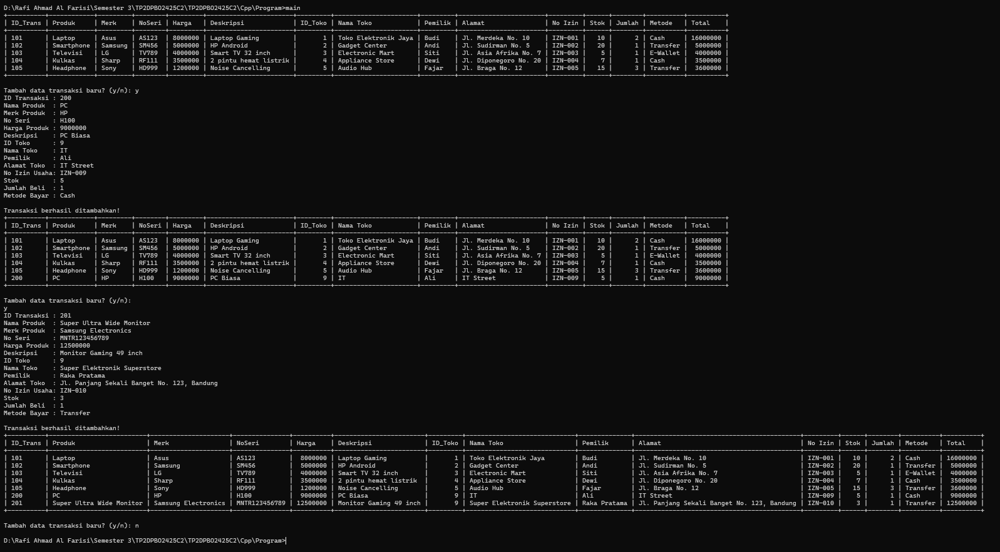
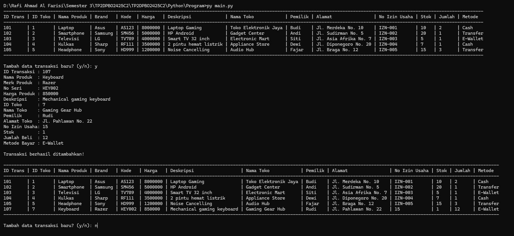
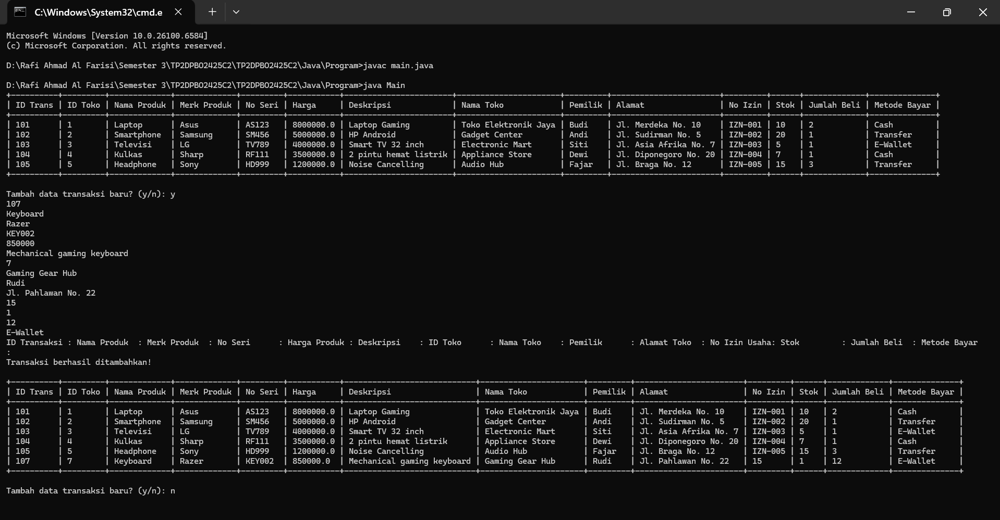
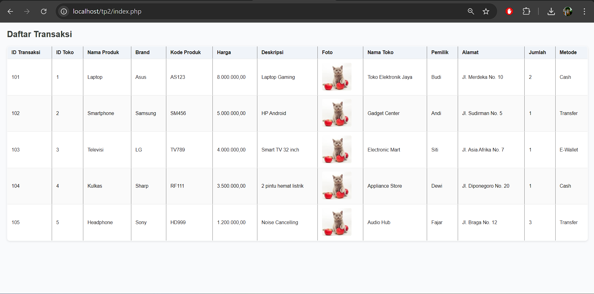

# TP2DPBO2425C2

Janji

saya Rafi Ahmad Al Farisi dengan NIM 2409829
mengerjakan TP 1 dalam mata kuliah Design Pemrograman Berbasis Object
untuk keberkahannya maka saya tidak akan melakukan kecurangan
seperti yang telah di spesifikasikan Aamiin.

Penjelasan Atribut dan Methods

-> Kelas Produk
    Ini adalah kelas dasar yang merepresentasikan sebuah produk.
    Atribut: Berisi properti seperti nama, merek, kode, harga, deskripsi, dan foto produk.
    Methods: Menyediakan fungsionalitas untuk membuat objek (constructor) serta metode getter dan setter untuk mengakses atau memodifikasi atributnya.

-> Kelas TokoElektronik
    Ini adalah kelas turunan dari Produk yang merepresentasikan toko yang menjual produk tersebut.
    Atribut: Menambahkan properti spesifik toko, seperti ID toko, nama toko, pemilik, dan alamat.
    Methods: Mengimplementasikan constructor yang memanggil kelas induk (Produk) dan metode getter serta setter untuk atributnya sendiri.

-> Kelas Transaksi
    Ini adalah kelas turunan dari TokoElektronik, yang merepresentasikan sebuah transaksi lengkap.
    Atribut: Berisi detail transaksi seperti ID transaksi, jumlah barang yang dibeli, dan metode pembayaran.
    Methods: Selain constructor dan getter/setter untuk atributnya, kelas ini juga memiliki metode statis yang bertanggung jawab untuk memformat dan menampilkan data transaksi dalam bentuk tabel.

Diagram

Penjelasan Alur Program
    1. Alur program dimulai dari file utama (misalnya, main.py atau Main.java).

    2. Program mengimpor kelas-kelas yang diperlukan (Transaksi, TokoElektronik, dan Produk).

    3. Sebuah daftar atau array data transaksi dibuat.

    4. Setiap elemen dalam daftar adalah sebuah objek Transaksi, yang dibuat dan diisi dengan data awal. Proses ini secara otomatis menginisialisasi properti dari kelas induknya (TokoElektronik dan Produk) melalui pewarisan.

    5. Setelah semua data disiapkan, program memanggil metode untuk mencetak tabel yang rapi ke konsol, menampilkan semua informasi transaksi.

Dokumentasi

-> CPP

-> Python

-> Java

-> PHP
